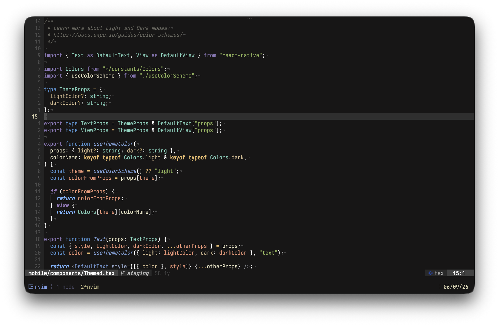

# nightingale.nvim



A Neovim theme ported from the Nightingale VS Code theme, featuring warm tones and excellent readability for long coding sessions.

## ✨ Features

- 🌳 **Enhanced TreeSitter:** Full semantic highlighting with JSX/TSX support
- 🔍 **LSP Semantic Tokens:** 26+ semantic token types and modifiers
- 🔌 **27+ Plugin Integrations:** nvim-cmp, telescope, mini.nvim suite, bufferline, trouble, and more
- 🖥️ **16 Terminal/Editor Themes:** Alacritty, Kitty, iTerm2, Helix, Fish, Lazygit, and more

## 📦 Requirements

- Neovim >= 0.8.0
- `termguicolors` enabled

## 📥 Installation

### [lazy.nvim](https://github.com/folke/lazy.nvim)

```lua
{
    "xeind/nightingale.nvim",
    lazy = false,
    priority = 1000,
    config = function()
        require("nightingale").setup()
        vim.cmd("colorscheme nightingale")
    end,
}
```

### [packer.nvim](https://github.com/wbthomason/packer.nvim)

```lua
use {
    "xeind/nightingale.nvim",
    config = function()
        require("nightingale").setup()
        vim.cmd("colorscheme nightingale")
    end
}
```

## ⚙️ Configuration

```lua
require('nightingale').setup({
    compile = false,
    undercurl = true,
    commentStyle = { italic = true },
    functionStyle = { italic = true },
    keywordStyle = { italic = true, bold = true },
    statementStyle = {},
    typeStyle = {},
    transparent = false,
    dimInactive = false,
    terminalColors = true,
    colors = { palette = {}, theme = { nightingale = {} } },

    -- Custom highlight overrides
    overrides = function(colors)
        local theme = colors.theme
        return {
            LineNr = { fg = theme.ui.fg_dim, bold = true },
            CursorLineNr = { fg = theme.diag.warning, bold = true },
            TelescopeBorder = { fg = theme.ui.float.fg_border },
        }
    end,
})

vim.cmd("colorscheme nightingale")
```

# All extras use the same color palette for perfect consistency across your entire development environment.

📖 **[View detailed installation guide →](./EXTRAS.md)**

## 🎨 Color Palette

### Core Colors

```lua
-- Syntax
green   = "#98BB6C"  -- Strings, success
blue    = "#85a8da"  -- Functions, primary
cyan    = "#7cd0bf"  -- Types, constants
purple  = "#a584c0"  -- Keywords, control flow
orange  = "#f5a284"  -- Constants, numbers
red     = "#ee5d43"  -- Errors, warnings
yellow  = "#E6C384"  -- Identifiers, parameters

-- UI
fg      = "#ffffff"  -- Main foreground
fg2     = "#DCD7BA"  -- Secondary foreground
bg      = "#202020"  -- Main background
gray    = "#727169"  -- Comments, disabled text
```

### Semantic Mappings

- **Strings/Success:** Green (`#98BB6C`)
- **Functions:** Blue (`#85a8da`)
- **Types:** Cyan (`#7cd0bf`)
- **Keywords:** Purple (`#a584c0`)
- **Constants:** Orange (`#f5a284`)
- **Errors:** Red (`#ee5d43`)
- **Parameters:** Yellow (`#E6C384`)
- **Comments:** Gray (`#727169`)

## 🙏 Acknowledgments

- Original [Nightingale VS Code Theme](https://marketplace.visualstudio.com/items?itemName=bfrangi.vscode-nightingale-theme) by bfrangi
- Theme structure inspired by [kanagawa.nvim](https://github.com/rebelot/kanagawa.nvim)
- Plugin integration patterns from [tokyonight.nvim](https://github.com/folke/tokyonight.nvim)

## 📄 License

MIT
