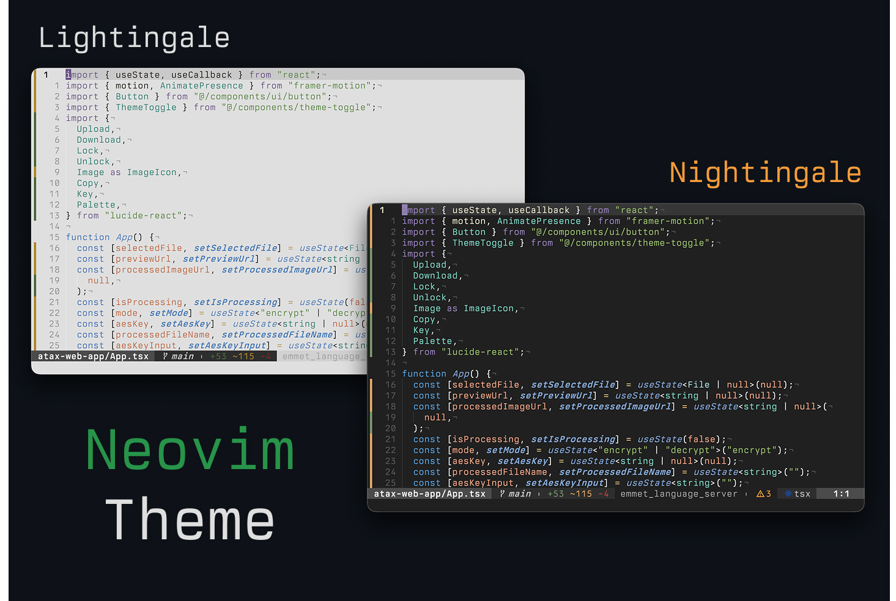

# Nightingale.nvim

A dark Neovim theme ported from the Nightingale VS Code theme, featuring warm tones and excellent readability for long coding sessions.

## Preview



## Features

- TreeSitter support
- LSP semantic highlighting
- Terminal colors support

## Requirements

- Neovim >= 0.8.0
- `termguicolors` enabled

## Installation

### [lazy.nvim](https://github.com/folke/lazy.nvim)

```lua
{
    "xeind/nightingale.nvim",
    lazy = false,
    priority = 1000,
    config = function()
        require("nightingale").setup({
            transparent = true,
        })
        vim.cmd("colorscheme nightingale")
    end,
}
```

### [packer.nvim](https://github.com/wbthomason/packer.nvim)

```lua
use {
    "xeind/nightingale.nvim",
    config = function()
        require("nightingale").setup({
            transparent = true,
        })
        vim.cmd("colorscheme nightingale")
    end
}
```

### [vim-plug](https://github.com/junegunn/vim-plug)

```vim
Plug 'xeind/nightingale.nvim'
```

Then in your `init.vim` or `init.lua`:

```lua
lua << EOF
require("nightingale").setup({
    transparent = true,
})
vim.cmd("colorscheme nightingale")
EOF
```

## Usage

As simple as:

```vim
colorscheme nightingale
```

```lua
vim.cmd("colorscheme nightingale")
```

## Configuration

There is no need to call setup if you are ok with the defaults.

```lua
-- Default options:
require('nightingale').setup({
    compile = false,             -- enable compiling the colorscheme
    undercurl = true,            -- enable undercurls
    commentStyle = { italic = true },
    functionStyle = { italic = true },
    keywordStyle = { italic = true, bold = true },
    statementStyle = {},
    typeStyle = {},
    transparent = false,         -- do not set background color
    dimInactive = false,         -- dim inactive window `:h hl-NormalNC`
    terminalColors = true,       -- define vim.g.terminal_color_{0,17}
    colors = {                   -- add/modify theme and palette colors
        palette = {},
        theme = { nightingale = {} },
    },
    overrides = function(colors) -- add/modify highlights
        return {}
    end,
})

-- setup must be called before loading
vim.cmd("colorscheme nightingale")
```

## Color Palette

The theme uses a carefully selected palette of warm, comfortable colors designed for long coding sessions:

- Background: Deep warm dark tones
- Foreground: Soft cream/beige
- Syntax: Greens, blues, purples, and warm accent colors
- UI: Subtle grays and warm borders

## Acknowledgments

- Original [Nightingale VS Code theme](https://marketplace.visualstudio.com/items?itemName=bfrangi.vscode-nightingale-theme) by bfrangi
- Theme structure inspired by [kanagawa.nvim](https://github.com/rebelot/kanagawa.nvim)

## License

MIT
